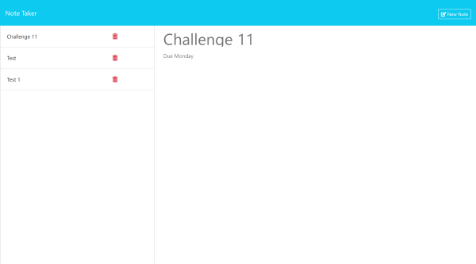
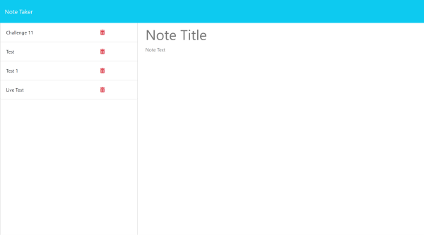

# Note Taker

This note taker was created for small business owners to be able to write and save notes. This will help them organize thoughts and keep track of tasks they need to complete.

## Description

This note taker was created as a challenge for bootcamp students to apply everything that was learned in module 11 of class. The challenge will make this note taker use Express.js back end and will and wil save and retrieve note data from a JSON file. It will use npm install for the build command and npm start for the start command.

## Acceptance Criteria

    - Having a source code
    - Given a note-taking application
    - When I open the Note Taker I am presented with a page with a link to a notes page
    - When I click on the link to the notes page I am presented with a page with existing notes listed in the left column, plus empty fields to enter a new note in the right column
    - When I enter a new note title and the note's text a "Save Note" button and a "Clear Form" button appear in the navigation at the top of the page
    - When I click the save button the new note entered is saved and appears in the left column with the existing notes and the buttons in the navigation disappear
    - When I click on an existing note the note appears in the right column and a "New Note" button appears in the navigation 
    - When I click the "New Note" button in the navigation I am presented with empty fields to enter a new note and the button disappears
    - When I click on the trash can icon the note is deleted

## Installation
 ```
npm install
  ```

## Run the app
 ```
npm start
  ```

## Screenshots








## Links

[Live URL](https://note-taker-lk75.onrender.com)

[GitHub Repo](https://github.com/zoniaramirez/note-taker)